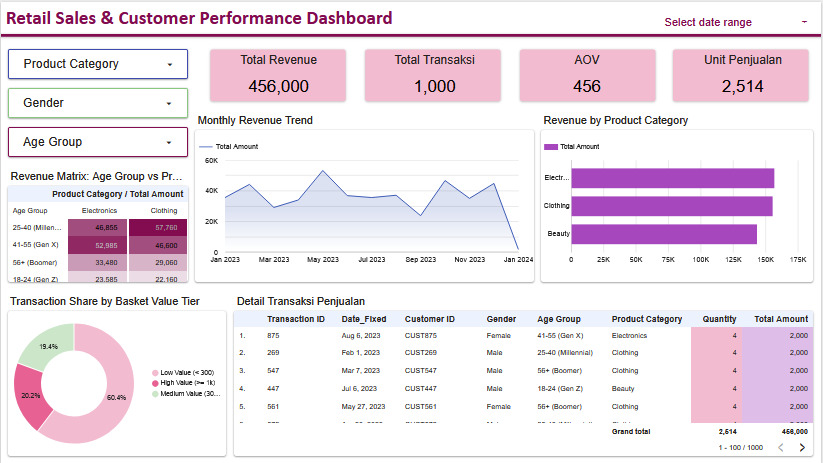

# Retail Sales & Customer Performance Dashboard

Interactive dashboard untuk menganalisis data transaksi retail dan melihat performa penjualan serta karakteristik customer.

## Project Overview

Project ini menggunakan dataset transaksi retail yang diperoleh dari dataset publik.

Dataset digunakan secara langsung sebagai data source di Data Studio untuk membuat dashboard interaktif yang menampilkan beberapa metrik dan visualisasi terkait penjualan dan customer.

## Dashboard Objectives

Dashboard ini dibuat untuk:

- Melihat total revenue dan jumlah transaksi
- Melihat Average Order Value (AOV)
- Melihat total unit yang terjual
- Melihat perkembangan revenue setiap bulan
- Membandingkan revenue berdasarkan product category
- Melihat distribusi customer berdasarkan gender dan age group
- Melihat proporsi transaksi berdasarkan basket value

## Key Metrics

| Metric | Value |
|---|---:|
| Total Revenue | 456,000 |
| Total Transactions | 1,000 |
| Average Order Value | 456 |
| Total Units Sold | 2,514 |

## Dashboard Features

### Sales Performance
- Total Revenue
- Total Transactions
- Average Order Value (AOV)
- Total Units Sold
- Monthly Revenue Trend

### Product Analysis
- Revenue by Product Category
- Comparison between Electronics, Clothing, and Beauty

### Customer Analysis
- Customer distribution by Gender
- Customer distribution by Age Group

### Transaction Analysis
- Transaction share based on Basket Value
- Transaction detail table

## Key Insights

Beberapa insight yang terlihat dari dashboard:

- Electronics memiliki revenue tertinggi dibandingkan product category lainnya.
- Transaksi dengan kategori Low Value memiliki proporsi terbesar, yaitu sekitar 60.4%.
- Medium Value transactions memiliki proporsi sekitar 19.4%.
- High Value transactions memiliki proporsi sekitar 20.2%.

## Tools

- Data Studio

## Dataset

Dataset yang digunakan dalam project ini merupakan dataset transaksi retail yang diperoleh dari sumber dataset publik.

Dataset digunakan secara langsung sebagai data source untuk dashboard.

[View Dataset (CSV)](retail_sales_dataset.csv)

## Dashboard Preview

## Live Dashboard

[View Interactive Dashboard](https://datastudio.google.com/reporting/50bcb2f1-9468-4227-9815-3df8a3450d9f)

## Project Workflow

1. Download retail sales dataset
2. Use the dataset as a data source in Data Studio
3. Create metrics and visualizations
4. Build the interactive dashboard
5. Review sales and customer performance insights

## Project Focus

This project focuses on presenting retail transaction data in an interactive dashboard to make sales performance and customer information easier to understand and explore.
